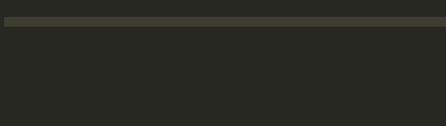
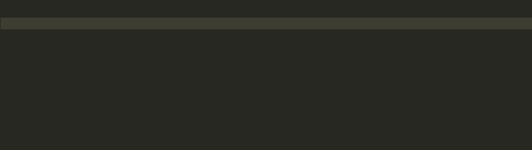
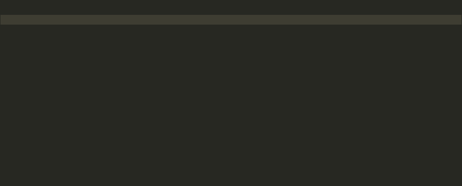
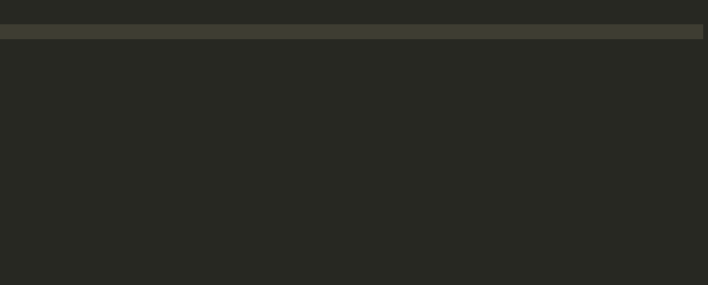
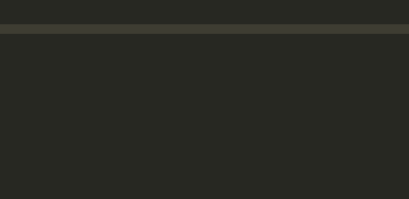

**Mitra Rocket IDE  Release Note**

**0.1.0**

**July, 2021**

**What’s New**

The extension includes the following features:

1. Intellisense for the Universe Basic Statements and Functions.As you type your program, you will be prompted with available statements and  functions including the syntax and description.
2. Internal Subroutine lookupPressing ctrl+space after the word **GOTO**, **GOSUB** will allow you to select from a defined internal subroutine in your program.
3. Custom TP Standard Subroutines
4. Create new TP Standard Program 
5. Create new TP Standard subroutine
6. Custom @() function in TP Screen Painter
7. Design and implement screens ( include ascii code commands for screen painter)

**Release Details**

- Release Version : 0.1.0
- Product Name : mitra-rocket-ide
- Files Name : snippets.json and MvLanguage.json
- Git Repository:Link -> https://github.com/MitraDigital/mitra-rocket-ide

**Deployment Steps**

1. Download links

- MV Basic Linkar extension -

  [https://marketplace.visualstudio.com/items?itemName=KosdaySolutions.mvbasiclinkar](https://)
- Monokai theme -

  [https://marketplace.visualstudio.com/items?itemName=gerane.Theme-Monokai](https://)

2. Set the following setting values are for 'Linkar' extension

- Go to manage > settings
- Go to Text Editor > set tab size to 3
- Go to Text Editor > Files under **‘User’** tab
- Go to Text Editor > Minimap > Tick the Render characters
- Go to Text Editor > Select the ‘**all’** option to Render whitespace
- Change following values
  - Add item under Associations
    - Item- \\*.\*
    - value - mvbasic
  - Set Default Language to **‘mvbasic’**
  - Set encoding to ‘**Western(ISO-8859-15)’**

3. Clone the mitra-rocket-ide repository from github.
4. Copy to snippets.json file and Go to extension installation folder then replace the snippets.json file

- Folder location - **C:\Users\<username>\.vscode\extensions\kosdaysolutions.mvbasiclinkar-1.0.3\Syntaxes**

5. Restart VS Code

**Knows Issues and Limitations**

**Issue Summary**

- N/A

**Limitation Summary**

- Debugger for Universe BASIC

Copyright © 2021 Mitra Innovation                                 
